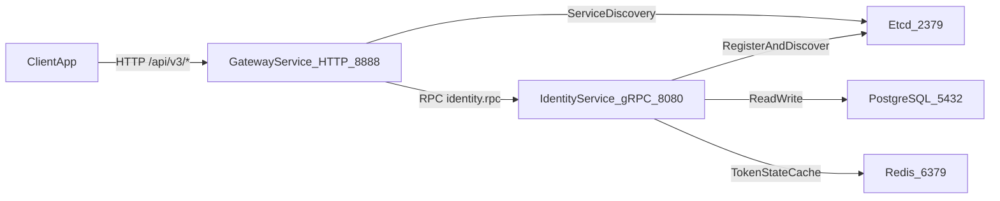

# Beehive Blog v3

Beehive Blog v3 是一个面向创作、沉淀、展示与 AI 协作的个人知识平台后端工程。  
产品方向继承 v2 的整体设计思路，工程实现采用 v3 的分层架构与契约优先（Contract-first）方式持续落地。

## Project Introduction

Beehive Blog 的目标不是“传统博客功能堆叠”，而是建立一套可长期演进的知识系统：

- 面向访客的 `Public Web`：用于公开展示文章、项目、经历与作品
- 面向创作者的 `Studio`：用于内容管理、关系沉淀、发布与审阅
- 面向智能协作的 `AI` 能力：以“可控、可审阅、可追踪”为前提参与创作流程

当前仓库已进入 v3 工程化阶段，核心关注点是：清晰服务边界、可维护代码结构、可验证本地运行路径。

## Product Direction (Inherited from v2)

v2 的大体产品设计方向在 v3 中仍然成立，当前 README 口径收敛为以下主线：

- **知识平台定位**：统一管理文章、笔记、项目、经历与时间线，不局限于单一博客模型
- **双面产品结构**：`Public Web + Studio`，分别承担“对外表达”和“内部生产”
- **关系化内容模型**：通过标签、关联与版本沉淀提升知识可复用性
- **搜索与发现能力**：搜索不仅是入口，也服务后续检索增强与 AI 协作
- **AI 受控协作**：AI 可辅助摘要/草稿生成，但发布必须经过人工审阅
- **权限与边界优先**：公开/登录/私密内容边界明确，避免内容越权暴露

## Current Scope & Roadmap (v3)

### Implemented Now

- `gateway`：统一 HTTP 接入层（含 `/api/v3/auth/*`、`/healthz`、`/readyz`、`/ws`）
- `identity`：认证与会话相关 RPC 服务（注册、登录、刷新、当前用户等）
- 本地基础依赖：PostgreSQL、Redis、Etcd

### Defined But Not Fully Implemented

- `edge`（边缘选路）
- `content`（内容主数据服务）
- `search`（检索服务）
- `indexer`（异步索引与派生 worker）
- `realtime`（实时模块，当前可先以内嵌方式承载于 gateway）

说明：上述模块边界已在 `docs/v3` 设计收口，后续按契约优先逐步实现。

## Architecture

### Runtime Flow (Current)



### Layer Boundary (Design Baseline)

- `gateway` 只做接入与治理（鉴权前置、限流、错误包装、连接承载），不承担业务编排
- 领域编排优先下沉到主业务服务内部
- 无明确业务主语的接口应独立服务承接，不回灌 `gateway`
- 服务发现、在线态、异步事件分别由 `etcd`、`redis`、`RabbitMQ` 分工承载（按 v3 规范演进）

## Features

- Contract-first 设计基线（`v3/api` 与 `v3/proto`）
- 多服务拆分与清晰边界（`services` + `docs/v3/contracts`）
- 统一工程能力沉淀（`pkg`）
- 测试与 QA 辅助工具（`qa`）
- CI 与规则检查支持（`.github/workflows`）

## Repository Structure

```text
.
├── data/              # 本地开发相关数据
├── docker/            # 容器与部署相关配置
├── docs/              # 项目文档
├── pkg/               # 跨服务可复用包
├── qa/                # 测试工具与客户端
├── scripts/           # 自动化脚本
├── services/          # 业务服务
├── sql/               # 数据库脚本
├── tools/             # 开发工具
└── v3/                # v3 合约定义与相关资产
```

## Local Startup (With Dependencies)

### Prerequisites

- Go（建议与 `go.mod` 保持一致）
- Docker Desktop（或 Docker Engine + Compose 插件）

### 1) Install Go Dependencies

```bash
go mod download
```

### 2) Start Infrastructure Services

在仓库根目录执行（启动 PostgreSQL、Redis、Etcd）：

```bash
docker compose -f docker/Infrastructure/docker-compose.yaml up -d
```

### 3) Run Database Migrations

Windows PowerShell：

```powershell
./sql/migrate.ps1
```

Linux / macOS：

```bash
./sql/migrate.sh
```

### 4) Configure Shared Internal Auth Token

请将以下两个配置中的 `InternalAuthToken` 设置为**同一个强随机字符串**：

- `services/identity/etc/identity.yaml`
- `services/gateway/etc/gateway.yaml`

### 5) Start Backend Services

启动 Identity（终端 1）：

```bash
go run ./services/identity -f services/identity/etc/identity.yaml
```

启动 Gateway（终端 2）：

```bash
go run ./services/gateway -f services/gateway/etc/gateway.yaml
```

### 6) Verify Service Health

```bash
curl http://127.0.0.1:8888/healthz
curl http://127.0.0.1:8888/readyz
```

### 7) Verify Minimal Auth Chain

```bash
curl -X POST "http://127.0.0.1:8888/api/v3/auth/register" \
  -H "Content-Type: application/json" \
  -d "{\"username\":\"demo_user_01\",\"email\":\"demo@example.com\",\"password\":\"Demo@123456\",\"nickname\":\"Demo\"}"
```

### 8) Optional: Run Full Test Suite

```bash
go test ./...
```

## Development Guidelines

- 贡献规范请参考 `CONTRIBUTING.md`
- 安全漏洞披露请参考 `SECURITY.md`
- 版本变更记录请参考 `CHANGELOG.md`

## Further Reading

### Product Direction (v2)

- [`docs/v2/README.md`](docs/v2/README.md)
- [`docs/v2/v2-product-design.md`](docs/v2/v2-product-design.md)
- [`docs/v2/v2-requirements-analysis.md`](docs/v2/v2-requirements-analysis.md)
- [`docs/v2/v2-architecture.md`](docs/v2/v2-architecture.md)

### Architecture & Implementation Baseline (v3)

- [`docs/v3/README.md`](docs/v3/README.md)
- [`docs/v3/contracts/service-contracts.md`](docs/v3/contracts/service-contracts.md)
- [`docs/v3/gateway/gateway-design.md`](docs/v3/gateway/gateway-design.md)
- [`docs/v3/identity/identity-service-design.md`](docs/v3/identity/identity-service-design.md)

## License

本项目基于 [GNU GPLv3](./LICENSE) 开源发布。  
This project is licensed under GNU GPLv3.